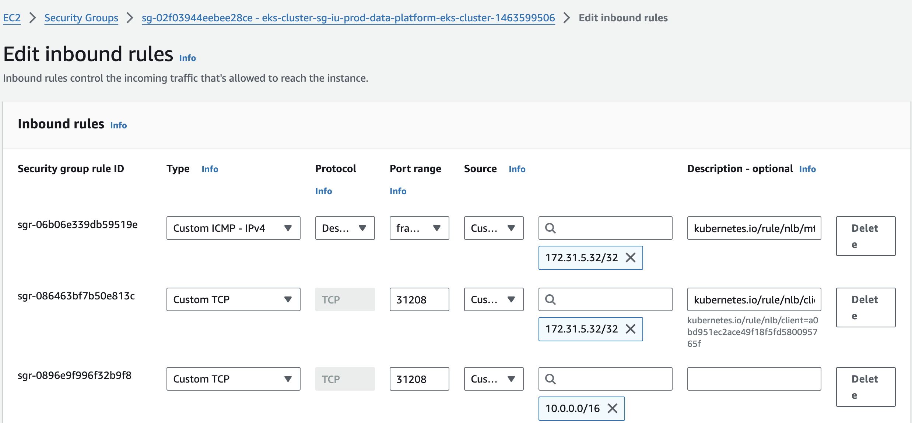
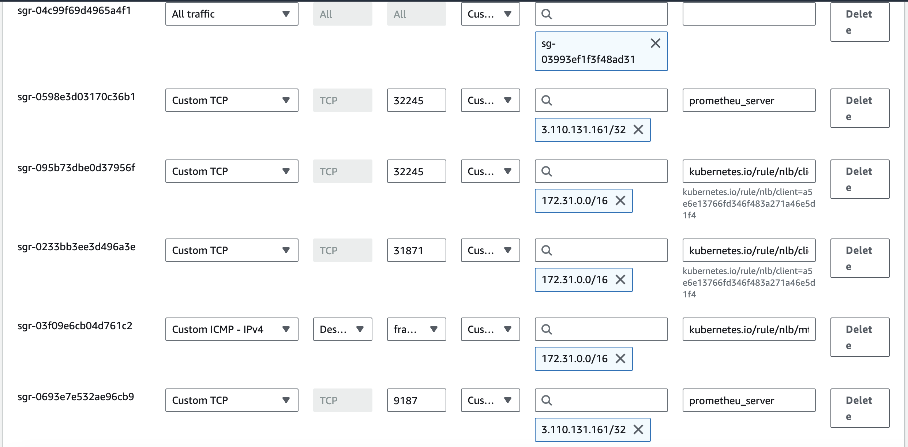

# EKS Security Groups & what sources to allow the traffic from

Note: By default EKS cluster security-group allows all traffic from the same security-group as a source. Rule shown below, DO NOT DELETE THIS RULE.


1. Current NLB are created using below yaml config, this by default opens the traffic to `0.0.0.0/0` from a nodeport

```yaml
apiVersion: v1
kind: Service
metadata:
  name: iu-timescaledb-eks-prod-1-service-loadbalancer
  namespace: timescaledb1
  annotations:
    service.beta.kubernetes.io/aws-load-balancer-internal: "true"
    service.beta.kubernetes.io/aws-load-balancer-scheme: internal
    service.beta.kubernetes.io/aws-load-balancer-type: nlb
    service.beta.kubernetes.io/aws-load-balancer-attributes: deletion_protection.enabled=true
spec:
  type: LoadBalancer
  selector:
    release: timescaledb
    app: timescaledb
  ports:
  - port: 5432
    targetPort: 5432
```
The above config opens a port on security-group from the source `0.0.0.0/0`,   

2. If you want to open the traffic to a specific sources/CIDR ranges, use the below updated NLB yaml config.

```yaml
apiVersion: v1
kind: Service
metadata:
  name: iu-timescaledb-eks-prod-1-service-loadbalancer
  namespace: timescaledb1
  annotations:
    service.beta.kubernetes.io/aws-load-balancer-internal: "true"
    service.beta.kubernetes.io/aws-load-balancer-scheme: internal
    service.beta.kubernetes.io/aws-load-balancer-type: nlb
    service.beta.kubernetes.io/aws-load-balancer-attributes: deletion_protection.enabled=true
spec:
  type: LoadBalancer
  selector:
    release: timescaledb
    app: timescaledb
  ports:
  - port: 5432
    targetPort: 5432
  loadBalancerSourceRanges:
  - "10.0.0.0/16"
  - "172.31.5.32/32"
```
Above config opens a nodeport on security-group from both the CIDR ranges `10.0.0.0/16` and `172.31.5.32/32`

3. Below images shows the current eks prod security-group `sg-02f03944eebee28ce` 




As shown in the above images, each port should be open from two sources, `10.0.0.0/16`(within the VPC) and `172.31.5.32/32` from VPN. This is true for both `prod` and `uat` cluster security-groups

Note: For SIT, nodeport should be opened from one source i.e `172.31.0.0/16`(within VPC). Current SIT security-group(`sg-03993ef1f3f48ad31`) rules shown below.




